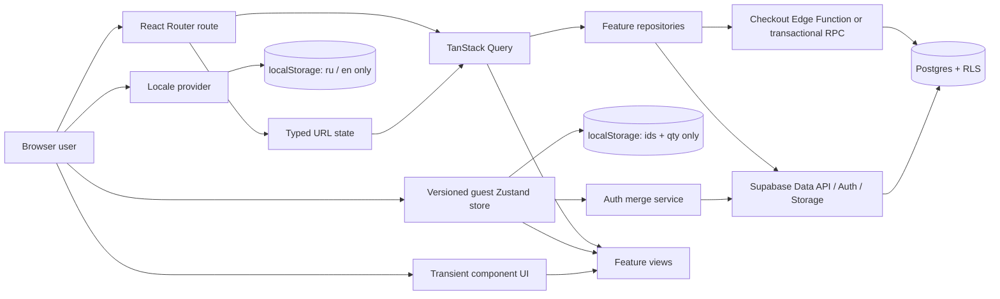

# Target architecture

> Статус: target-state technical contract
> Дата: 2026-08-28
> Scope: portfolio-grade Vite/React storefront; implementation not started
> Product requirements: [TRANSFORMATION_SPEC.md](./TRANSFORMATION_SPEC.md)

## 1. Architecture decision summary

| Decision | Choice | Why | Explicitly not chosen |
|---|---|---|---|
| App shape | Client-rendered SPA, route-oriented | Максимум frontend depth и скорость; deploy на static host | SSR/Next.js в v1 |
| Build | Vite 8.x stable, exact version pinned at implementation | CRA deprecated; current Node 22.15 satisfies Vite 8 Node range | CRA/react-scripts |
| React | Upgrade to current stable React 19 after Vite parity gate | Актуальная supported baseline | React Compiler без profiling need |
| Language | TypeScript `strict` from foundation | Domain contracts ловят ошибки variants/cart/orders | Долгий mixed JS/TS режим |
| Routing | React Router 7 Data Mode, lazy route modules | Nested routes, errors, loaders/prefetch, URL APIs | Router replacement или ad-hoc pathname state |
| Server state | TanStack Query v5 | Cache/dedupe/cancel/retry/mutations для Supabase/API data | Копия remote data в global store |
| URL state | React Router `URLSearchParams` + typed codec | Share/reload/back-forward/canonical query keys | Search/filter в Zustand/useState |
| Guest domain state | Небольшой persisted Zustand store: cart + guest wishlist only | Cross-route cart без provider boilerplate; versioned persistence | «Один store для всего» |
| Locale | React context + versioned localStorage preference | RU default, persisted RU/EN without duplicating domain data | Переводить footwear brand/model names |
| Complex global workflows | Не вводить Redux Toolkit сейчас | Нет workflow, который оправдывает второй state architecture | Redux ради portfolio checkbox |
| Backend | Supabase Postgres + Auth + Storage; Edge Function/RPC для checkout | Relations, auth, RLS, order history и transaction-shaped flow | Shared MockAPI, Firebase document model, custom Node backend v1 |
| HTTP | Supabase client; native `fetch` для отдельного server endpoint | Axios больше не даёт уникальной ценности | Обновлённый Axios только ради одного transport |
| Styling | CSS Modules + Dart Sass + CSS custom-property tokens | Сохраняет полезный SCSS навык и даёт custom art direction | `node-sass`, `macro-css`, обязательный Tailwind |
| Forms | Native semantics + React Hook Form/Zod только для checkout/account forms | Complex validation и typed boundary без применения ко всем inputs | Form library для catalog search/filter |
| Tests | Vitest + RTL + MSW; Playwright + axe; Supabase DB/RLS tests | Одна Vite transform pipeline и browser confidence | Snapshot-heavy/component-internals tests |

Версии в документе — baseline на дату аудита, не разрешение ставить `latest` без проверки. При implementation milestone exact packages сверяются с official docs/changelogs, pin-ятся lockfile и обновляются только контролируемо.

## 2. Почему Vite SPA, а не Next.js/full-stack framework

React рекомендует framework для приложений с routing, но также прямо допускает migration существующего CRA на Vite. Здесь цель — сильный frontend case с Supabase как backend, а не SEO-led public retailer. Vite SPA:

- минимизирует big-bang migration;
- оставляет фокус на URL/data/forms/accessibility/testing;
- хорошо deploy-ится на CDN/static host;
- не добавляет RSC/server-auth complexity до появления требования.

Осознанная цена: initial HTML не содержит catalog content, organic SEO и social previews динамических PDP ограничены. Если SEO становится business goal, решение пересматривается **до** окончательной route/data implementation. Feature modules, repository boundary и route map должны позволить перейти к React Router Framework Mode или другому framework без переписывания domain layer.

Источники: [React: Sunsetting CRA](https://react.dev/blog/2025/02/14/sunsetting-create-react-app), [React: Creating an app](https://react.dev/learn/creating-a-react-app), [Vite 8](https://vite.dev/blog/announcing-vite8).

## 3. System context



Главное правило: стрелка может идти из source of truth в view, но не создаёт вторую долгоживущую копию того же state.

## 4. State ownership

| State | Owner | Persistence | Examples | Запрещено |
|---|---|---|---|---|
| Route/navigation | React Router | URL/history | path, checkout step | `window.location` вручную без router |
| Catalog discovery | Typed URL codec | URL | q, facets, sort, page | Дублировать в Zustand/Context |
| Remote entities | TanStack Query cache | Memory + refetch | products, stock, user wishlist, orders | Копировать response в Zustand |
| Guest cart/wishlist | Zustand feature store | Versioned localStorage | `inventoryId`, `productId`, quantity | PII, prices, full API objects |
| Interface locale | Locale provider | Versioned localStorage | `ru` default or `en` | Переводить footwear brand/model identity |
| Auth session | Supabase Auth provider/client | SDK-managed secure session | user/session lifecycle | Копировать tokens в localStorage вручную/store |
| Checkout draft | Form layer; optional minimal session persistence | Memory/sessionStorage for non-sensitive fields | contact/delivery form | Payment secrets, full auth data |
| Guest receipt capability | Checkout receipt service | sessionStorage, short TTL | opaque receipt token only | URL, localStorage, Query persistence, logs |
| Transient UI | Local React state | None | drawer open, gallery index, inline disclosure | Global store без cross-route need |
| Derived values | Pure selectors/functions | None | subtotal, active-filter count | Хранить отдельно от inputs |

Locale changes interface copy, editorial descriptions, categories, use-case/color
taxonomy, date/money formatting and document/social metadata. Solecraft and footwear
brand/model names are locale-invariant. Compatibility storage keys are migrated
copy-first: an existing new value is never overwritten, and a legacy value is removed
only after the new write succeeds.

### Why not Redux Toolkit

Redux Toolkit качественен и обязателен, если выбран Redux. Но в этом продукте:

- remote state уже имеет специализированный owner — TanStack Query;
- catalog state должен быть URL;
- cart reducer/domain math тестируется чистыми функциями, а небольшой guest store покрывает persistence;
- добавление RTK создаст вторую event/cache model без бизнес-выгоды.

Revisit trigger: сложные offline queues, много orchestration между независимыми domains, audit/replay requirements или команда стандартизирует RTK. Если такой trigger появится, надо выбрать RTK/RTK Query как цельную альтернативу, а не наслаивать его поверх существующих cache copies.

### Why Zustand is intentionally small

Zustand разрешён только для `guest-cart` и `guest-wishlist` slices. Store API не возвращает server entities. Persisted schema имеет `version`, `migrate`, validation и минимальный payload. Selectors должны быть узкими; actions делегируют pricing/merge правила pure domain functions.

## 5. Route architecture

```text
/
├─ /catalog
├─ /products/:slug
├─ /wishlist
├─ /cart
├─ /auth/sign-in
├─ /auth/callback
├─ /checkout
│  ├─ /contact
│  ├─ /delivery
│  ├─ /payment
│  ├─ /review
│  └─ /success/:orderNumber
├─ /account
│  └─ /orders
│     └─ /:orderNumber
└─ *
```

Rules:

- root layout содержит skip link, header, main outlet, footer, global live region и error boundary;
- route module — unit code splitting; home, catalog, PDP, checkout и account не входят в один eager bundle;
- `/cart` — canonical accessible surface; quick cart drawer использует ту же feature view model;
- loaders применяются для param validation, auth redirect и Query prefetch там, где это убирает waterfall; Query остаётся cache owner;
- route error boundary отличает 404, auth, recoverable network и unexpected error;
- `useSearchParams` скрыт за единым catalog codec, чтобы parse/serialize не размножались по components;
- PDP colorway использует `/products/:slug?color=:variantSlug`: default omitted, committed switch pushes history, invalid value canonicalized with replace; selected size остаётся local и сбрасывается, если несовместим с новым variant;
- static host обязательно имеет SPA fallback и проверку direct deep links.

React Router документирует navigation-producing search params и route loaders: [useSearchParams](https://reactrouter.com/api/hooks/useSearchParams), [Data Loading](https://reactrouter.com/start/data/data-loading).

## 6. Source layout

Feature-first структура без полной FSD-церемонии:

```text
src/
├─ app/
│  ├─ router/
│  ├─ providers/
│  ├─ layouts/
│  └─ config/
├─ routes/
│  ├─ home/
│  ├─ catalog/
│  ├─ product/
│  ├─ cart/
│  ├─ checkout/
│  ├─ wishlist/
│  ├─ account/
│  └─ not-found/
├─ features/
│  ├─ catalog-discovery/
│  ├─ product-variants/
│  ├─ cart/
│  ├─ wishlist/
│  ├─ auth/
│  ├─ checkout/
│  └─ orders/
├─ entities/
│  ├─ product/
│  ├─ variant/
│  ├─ cart-line/
│  └─ order/
├─ shared/
│  ├─ api/
│  ├─ config/
│  ├─ lib/
│  ├─ ui/
│  └─ styles/
├─ test/
└─ main.tsx

e2e/
supabase/
├─ migrations/
├─ seed.sql
└─ tests/
```

Boundary rules:

- `shared` не импортирует features/routes;
- entities не знают о UI routes;
- feature public API минимален; не создавать barrel files, которые тянут тяжёлые modules в route chunk;
- route собирает features, но business rules живут в pure domain/services;
- Supabase row types адаптируются в domain models в repository boundary, не протекают во все components.

## 7. Domain model

### Catalog

| Table/entity | Essential fields | Invariants/indexes |
|---|---|---|
| `brands` | id, slug, name | unique slug |
| `categories` | id, slug, name | unique slug |
| `products` | id, slug, brand_id, category_id, model, title, description, status, fit_width, cushioning, support_level, fit_note, fit_provenance, fit_reviewed_at, published_at | unique slug; constrained fit values; index status/category/brand/published |
| `tags` | id, slug, label, type | unique type/slug; index type; `use_case` is a constrained type |
| `product_tags` | product_id, tag_id | composite unique; FKs; indexes both traversal directions |
| `product_variants` | id, product_id, slug, color_name, color_code, price_minor, compare_at_minor, currency | unique product/slug; price checks; product index |
| `product_media` | id, variant_id, kind, storage_path, alt, width, height, position | unique position per variant; stable dimensions |
| `sizes` | id, system, value, display_label, sort_order | unique system/value |
| `brand_size_guide_entries` | brand_id, size_id, foot_length_min_mm, foot_length_max_mm, provenance, source_note, reviewed_at | unique brand/size; valid mm range; source required unless unknown |
| `inventory` | id, variant_id, size_id, sku, stock_on_hand | exact sellable identity; unique SKU and variant/size; stock ≥0 |

Primary UI size system — EU; sourced foot length хранится integer mm и форматируется в cm. Универсальная RU/EU/CM conversion не вычисляется при отсутствии brand source.

Fit fields constrained: width = `narrow | standard | wide | extra_wide | unknown`; cushioning = `firm | balanced | soft | unknown`; support = `flexible | balanced | structured | unknown`; fit note = `runs_small | true_to_size | runs_large | unknown`. «Линия посадки» читает первые три tracks, use cases читает из typed tags и не хранит magic score. `unknown` отображается как not assessed. Provenance = `manufacturer | editorial_demo | unknown`; claims остаются guidance, а не персональной гарантией.

### Customer commerce

| Table/entity | Essential fields | Invariants/security |
|---|---|---|
| `profiles` | user_id, display_name, created_at | owner-only write |
| `wishlist_items` | user_id, product_id, preferred_variant_id, created_at | unique user/product; owner-only |
| `carts` | id, user_id, status, updated_at | one active cart/user |
| `cart_items` | cart_id, inventory_id, quantity | unique cart/inventory; quantity >0 |
| `orders` | id, order_number, user_id nullable, email, status, currency, subtotal_minor, delivery_minor, discount_minor, total_minor, idempotency_key, created_at | unique order number/idempotency; private |
| `private.order_receipt_capabilities` | order_id, token_hash, expires_at, created_at | guest orders only; token hash, revoke/expiry indexes; no browser table grants |
| `order_items` | order_id, inventory_id nullable, product/variant/size/SKU snapshots, unit_price_minor, quantity, line_total_minor, image snapshot | immutable snapshots |

Addresses/PII либо хранятся в защищённой `order_addresses` с минимальным retention, либо snapshot JSON с явной schema и private grants. Конкретный вариант фиксируется до checkout migration.

Для guest success route order number не является credential. Checkout выдаёт короткоживущий opaque receipt token, сохраняет только его hash в non-exposed schema, а browser держит raw token только в `sessionStorage`. Receipt endpoint принимает token в request body, проверяет scope/expiry и возвращает PII-minimized summary. Missing, wrong или expired token отвечает одинаково и не раскрывает existence заказа.

### Why relational backend

Variant-size inventory, unique constraints, atomic order creation и user ownership естественно моделируются Postgres. Local JSON/MSW полезен как deterministic adapter для разработки/tests, но не закрывает auth/order history. Firebase-style documents потребуют вручную поддерживать consistency тех же relations. Custom Node API увеличивает backend scope без portfolio-преимущества на v1.

## 8. Supabase security and transaction contract

Supabase здесь — не «готовая безопасность». Browser получает только project URL и publishable key; реальная authorization задаётся grants + RLS.

Required policies:

- RLS включена на каждой table/view-backed table в exposed schema; catalog/reference data открываются только явными read policies и минимальными grants;
- public/anon/authenticated могут читать только published catalog и безопасные inventory fields;
- drafts, internal costs и admin metadata не должны находиться в exposed public view;
- `wishlist_items`, active carts/items, profiles и orders — только `auth.uid() = user_id`;
- `UPDATE` policy имеет и `USING`, и `WITH CHECK`; ownership не меняется клиентом;
- views в exposed schema используют `security_invoker = true` или не выдаются public roles;
- service/secret key никогда не попадает в Vite env/client bundle;
- grants проверяются отдельно от RLS: policy не заменяет table privileges;
- каждая allow policy имеет paired deny test для anon, owner и different user.
- `private.order_receipt_capabilities` не доступна browser roles; узкий receipt endpoint проверяет token hash/TTL и возвращает только разрешённый projection.

Checkout не выполняется набором client inserts. Edge Function или transactional RPC:

1. принимает cart lines, delivery choice и idempotency key, но не доверяет client prices;
2. блокирует/проверяет inventory;
3. читает authoritative prices;
4. валидирует stock и caps;
5. создаёт order + immutable items;
6. атомарно корректирует stock;
7. для guest создаёт short-lived receipt capability; opaque token детерминированно re-issued для того же idempotency result или безопасно rotated, а database хранит только hash;
8. возвращает authoritative order summary и raw guest token ровно через server response;
9. при повторе idempotency key возвращает созданный order, а не создаёт второй.

`SECURITY DEFINER` не используется как shortcut от RLS error. Если он действительно нужен, function находится в non-exposed schema, явно проверяет identity и имеет минимальный `EXECUTE` grant.

Official references: [Supabase React quickstart](https://supabase.com/docs/guides/getting-started/quickstarts/reactjs), [Row Level Security](https://supabase.com/docs/guides/database/postgres/row-level-security), [Secure data](https://supabase.com/docs/guides/database/secure-data).

## 9. Data access and query design

Каждая feature имеет repository interface. Production adapter использует Supabase; tests/dev fixture adapter — MSW или in-memory data через тот же contract.

```ts
type CatalogParams = {
  q?: string
  brands: string[]
  uses: string[]
  size?: string
  width?: string
  colors: string[]
  priceMin?: number
  priceMax?: number
  inStock?: boolean
  sort: CatalogSort
  page: number
}
```

`uses[]` однозначно отображается на `tags.slug` с `type = 'use_case'`; repository query использует indexed join и не выводит use case из marketing copy.

Provisional query keys:

```text
['catalog', normalizedCatalogParams]
['product', slug]
['inventory', variantId]
['wishlist', userId]
['cart', 'server', userId]
['orders', userId, page]
['order', userId, orderNumber]
```

Rules:

- query key factory принимает только normalized serializable values;
- request получает `AbortSignal`, когда transport поддерживает cancellation;
- catalog/product имеют moderate stale time; inventory/cart — короткий; exact values настраиваются измерениями;
- error retry отключён для validation/auth/404, ограничен с backoff для transient network/5xx;
- stale data остаётся видимой при background refetch;
- wishlist/cart mutations могут быть optimistic только с snapshot rollback и authoritative response;
- checkout/order creation никогда не optimistic;
- malformed external/fixture payload валидируется на boundary; generated Supabase types не заменяют runtime checks там, где данные недоверенные.

TanStack Query используется ради server-state semantics, а не как general state store: [official overview](https://tanstack.com/query/latest/docs/framework/react).

## 10. Guest cart and auth merge

Persisted payload:

```ts
type GuestCommerceStateV1 = {
  version: 1
  cart: Array<{ inventoryId: string; quantity: number }>
  wishlistProductIds: string[]
}
```

Никаких prices, titles, images, email/address или auth tokens. UI гидрирует current entity/price/stock через Query.

Login merge algorithm:

1. snapshot guest state;
2. fetch current user cart/wishlist;
3. merge cart по `inventoryId`, quantity = constrained sum или другое заранее зафиксированное правило;
4. remove unavailable lines в conflict result, не молча;
5. upsert server state одной retry-safe operation;
6. invalidate/refetch authoritative user data;
7. clear guest state только после confirmed success;
8. показать concise merge summary.

Sign-out очищает user-specific Query cache. Guest store не заполняется автоматически private server cart, чтобы данные одного account не утекли следующему пользователю устройства. Multi-tab v1 синхронизируется через browser storage event/BroadcastChannel с documented last-write/merge semantics.

## 11. UI architecture and design system

### Token layers

```text
primitive palette/type/spacing
        ↓
semantic tokens: surface/text/border/action/status/focus
        ↓
component tokens: button/card/dialog/field
        ↓
feature composition
```

CSS custom properties дают runtime semantic theme; Sass используется для authoring/mixins/build-time structure. Literal colors в features запрещены, кроме documented data visualization values. `macro-css` удаляется: особенно недопустим global `outline: none`.

Core primitives:

- `Button`, `IconButton`, `LinkButton`;
- `TextField`, `SearchField`, `Select`/native select, `Checkbox`, `Chip`;
- `Dialog/Sheet`, `Popover`, `Accordion`;
- `Price`, `Badge`, `ProductCard`, `SizePicker`;
- `Skeleton`, `EmptyState`, `InlineError`, `ErrorPage`, `Toast/LiveMessage`.

Native elements используются первыми. Для dialog/popover допускается **один** headless primitive package после spike и accessibility verification; нельзя смешивать несколько competing systems. Component contract содержит hover/active/focus-visible/selected/disabled/loading/error/reduced-motion/forced-colors.

## 12. Error model

Unified frontend error categories:

```text
validation       → inline field/filter guidance
unauthenticated  → safe return-to sign-in
forbidden        → no data leakage, account recovery
not-found        → product/order/route-specific 404
conflict         → stock/price/cart merge resolution
rate-limited     → retry-after guidance
network/timeout  → preserve user input + retry
server           → recoverable generic path + trace id
unexpected       → route boundary + safe logging
```

Repository maps provider-specific errors to this contract. UI never renders raw backend messages. Error boundaries report safe context, not PII. Every mutation defines pending, success, error, rollback and duplicate-submit behavior before code review.

## 13. Performance architecture

- route modules lazy by default; checkout/account do not enter catalog bundle;
- direct imports; avoid broad barrels and optional feature imports in root;
- prefetch PDP/query on user intent, not every card at mount;
- responsive AVIF/WebP, width/height/aspect ratio, below-fold lazy loading;
- one controlled LCP image; self-hosted subset fonts with `font-display: swap`;
- pagination first; `content-visibility` can help long below-fold grids; virtualization only after profiling;
- search input updates immediately, expensive result transition/debounce separately;
- no speculative `memo`, Redux, virtualization or React Compiler without measurement;
- version/minimize localStorage data and cache reads;
- bundle analyzer and Lighthouse artifacts produced at hardening gate.

Initial budgets are defined in the spec. Core Web Vitals targets: LCP ≤2.5 s, INP ≤200 ms, CLS ≤0.1 at p75: [Web Vitals](https://web.dev/articles/vitals).

## 14. Test architecture

### Unit

- money/discount/total functions;
- URL parse/normalize/serialize round trips;
- filter/sort mapping;
- cart unique-line/quantity/stock rules;
- guest/server merge and persisted schema migration;
- order status/presentation mapping.

### Component/integration — primary frontend layer

Vitest + React Testing Library + user-event + MSW:

- behavior through accessible roles/names, not component internals;
- loading/empty/error/success;
- background refresh without UI collapse;
- mutation pending, rapid clicks, rollback and retry;
- router memory history for URL/back-forward;
- form keyboard/autofill-compatible validation.

Testing Library principle: tests should resemble how software is used: [official intro](https://testing-library.com/docs/react-testing-library/intro/).

### Database/security

- migrations replay from zero;
- constraints/unique/check tests;
- RLS allow/deny for anon, owner, other user;
- checkout idempotency, price/stock conflict and atomic rollback;
- guest receipt missing/wrong/expired token, TTL/revocation, idempotent re-issue и PII-minimized projection;
- generated types refreshed after migration.

### Browser E2E

Playwright against deterministic isolated seed/backend:

- PR: Chromium critical path + axe + console/network guard;
- release/scheduled: Chromium, Firefox, WebKit and representative viewports;
- guest checkout success → same-session refresh; fresh session/no token fails closed without order disclosure;
- manual AT evidence: current stable NVDA + Firefox desktop и TalkBack + Chrome mobile; недоступная pairing оставляет release gate открытым;
- visual snapshots only for stable critical surfaces, reviewed intentionally;
- no E2E against shared mutable MockAPI.

Playwright provides isolated multi-browser test execution: [official docs](https://playwright.dev/docs/intro). Axe automation catches only a subset, so keyboard/screen-reader/zoom review remains manual: [axe-core](https://github.com/dequelabs/axe-core).

## 15. Environment and deployment

Expected public frontend env:

```text
VITE_APP_ENV
VITE_SUPABASE_URL
VITE_SUPABASE_PUBLISHABLE_KEY
VITE_ENABLE_DEMO_PAYMENT
```

Server-only secrets живут только в Supabase/hosting secret manager. `.env.example` содержит names и safe descriptions, не values.

Environments: local/dev, isolated test, production. Default isolation — local Supabase test stack или dedicated hosted test project и отдельный production project; другая schema внутри production project не изолирует Auth/Storage/config. Tests никогда не используют production project. Supabase migrations/seed — source of truth; dashboard-only schema edits запрещены. Deploy gate проверяет SPA rewrites для каждого deep link, cache headers для hashed assets, no-store/private handling для sensitive responses и source maps policy.

Если когда-либо используется Docker/Compose:

- для новых ресурсов используется compose project name `07-solecraft`; существующий
  локальный Supabase сохраняет identity `react-sneakers-para` ради совместимости с volume;
- host ports проверяются до bind;
- Supabase CLI/local stack получает уникальный project ID и проверенные порты, а не default identity соседнего repo;
- запрещено останавливать/удалять containers, networks или volumes других projects;
- destructive cleanup адресует только заранее проверенные ресурсы этого project.

## 16. Migration strategy

1. Зафиксировать current behavior как minimal smoke contract; shared cart data не переносить.
2. CRA → Vite/Dart Sass и strict TypeScript на малой codebase; не строить parallel app.
3. Создать router/providers/test harness и vertical catalog tracer через typed fixtures.
4. Ввести Supabase schema/migrations/RLS и заменить fixture adapter catalog feature.
5. Добавлять features по user journey; не создавать «все types/components/backend tables» горизонтальным слоем.
6. Удалять legacy code/dependencies только когда соответствующий slice принят browser gate.

## 17. Architectural guardrails

M10 hosting decision (2026-09-08): Vercel Build Output API v3 для статического frontend,
облачный Supabase для существующего backend. Hosted build требует реальные public
settings и генерирует CSP с exact project origin; localhost fallback запрещён.
Конфигурация/порядок: `docs/DEPLOYMENT.md`. Local dev 32600, preview 32601, прочие host
binds только 32600–32699; фактическая port map и сохранённые volume/backup identities
зафиксированы в `docs/RELEASE_PREPARATION.md`.

- Новая dependency требует конкретной capability, alternatives и bundle/maintenance note.
- Не хранить server entity copies в Zustand/Context.
- Не принимать client totals/stock как authority.
- Не писать RLS без deny tests.
- Не делать hidden mutation или side effect в render.
- Не использовать index/image/title как stable domain identity.
- Не откладывать error/a11y/responsive на «final polish».
- Не включать real payment, admin, realtime, PWA или SSR до отдельного scope decision.
- Не обновлять major packages «заодно» вне foundation/dependency milestone.
